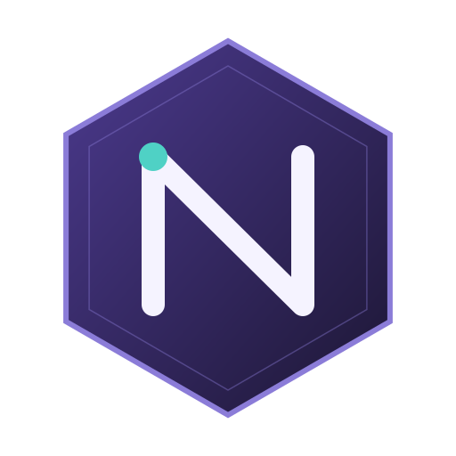

# Nuzlocke Tracker

<p align="center">
  
</p>

<p align="center">
  
</p>

Personal project to track details about Nuzlocke playthroughs.

## Getting Started

Frontend and backend are separate packages. Hosting is tailored for Vercel (`vercel.json` in each directory).

```shell
# Clone
git clone https://github.com/jakekohl/nuzlocke-tracker

# Backend
cd backend
npm i
cp .env.example .env
# Fill MONGODB_* (or MONGODB_URI) and BOOTSTRAP_SECRET
npm run dev:api

# Frontend (new terminal)
cd frontend
npm i
cp .env.example .env
# Set VITE_API_BASE_URL to the backend URL (e.g. http://localhost:3000)
npm run dev
```

Agent conventions and testing expectations live in [`AGENTS.md`](AGENTS.md).

## Services

- **Backend:** One Vercel serverless function (`api/index.js`) with `vercel.json` rewrites so all `/api/*` hit that function. MongoDB (Atlas recommended).
- **Frontend:** Vue 3 SPA.

### Auth / creating a user

Users are identified by **email**. Each user gets a personal access key (`nuz_…`). Only the SHA-256 hash is stored.

Create a user with the bootstrap secret (returned `apiKey` is shown once):

```shell
curl -X POST "$API_BASE/api/users" \
  -H "Content-Type: application/json" \
  -H "x-bootstrap-secret: $BOOTSTRAP_SECRET" \
  -d '{"email":"you@example.com","name":"You"}'
```

Paste the `apiKey` into the frontend Settings page. Use **Verify Connection** (`GET /api/auth/me`) to confirm.

While signed in, rotate your own key (invalidates the old key; new `apiKey` is shown once):

```shell
curl -X POST "$API_BASE/api/users/rotate-key" \
  -H "Content-Type: application/json" \
  -H "x-api-key: $API_KEY"
```

If you lose a key, reset it with the bootstrap secret (old key is invalidated; new `apiKey` is shown once):

```shell
curl -X POST "$API_BASE/api/users/reset-key" \
  -H "Content-Type: application/json" \
  -H "x-bootstrap-secret: $BOOTSTRAP_SECRET" \
  -d '{"email":"you@example.com"}'
```

In production, set `CORS_ORIGINS` on the backend to your real frontend origin(s) (comma-separated). Do not use `*`.


## Tests

- **Frontend:** Vitest (`npm run test:unit`) and Cypress e2e (`npm run test:e2e` / `test:e2e:dev`)
- **Backend:** Node test runner (`cd backend && npm test`)

## Disclaimers

Unofficial fan project — not affiliated with Nintendo, Game Freak, Creatures Inc., or The Pokémon Company. Pokémon and related marks belong to their respective owners.

Provided as-is for personal, non-commercial use with no warranties. Authors are not liable for damages or data loss. See the site footer for the full disclaimer text.
